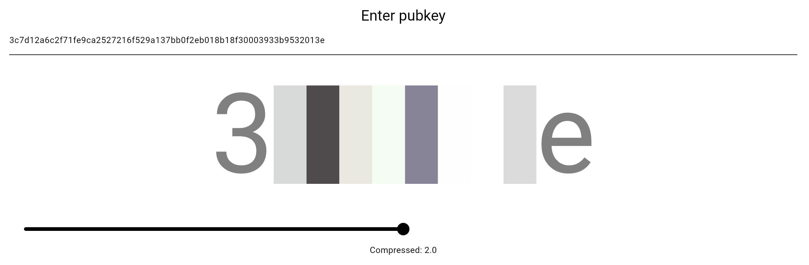

# hexpattern

A reference implementation of Nostr pubkey to colors.

[Live demo](https://1l0.github.io/hexpattern/)

## Why?

- `npub` is nonsense to display.
  - too long.
- `npub1bla...bla` is nonsense to display.
  - `npub1` takes too much space.
  - `...` means nothing.

## Specs

- Uses hex pubkey.
- Converts 64 characters to 8 colors.
- Supports dark and light theme by using AHSL instead of ARGB.
